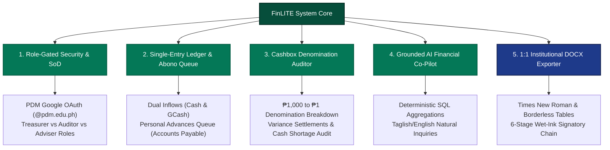
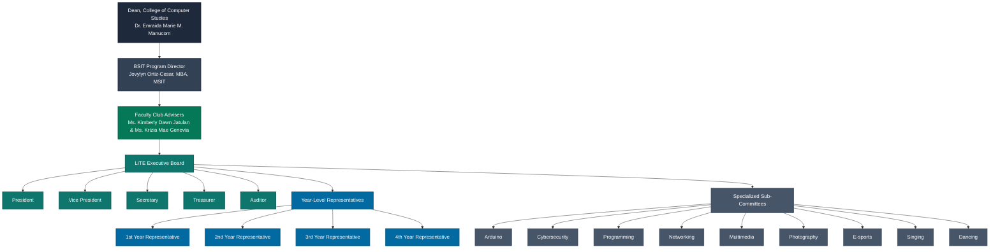
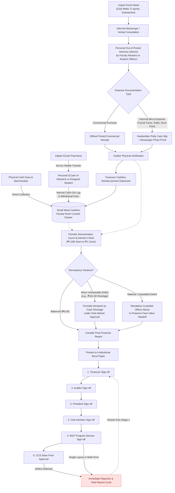
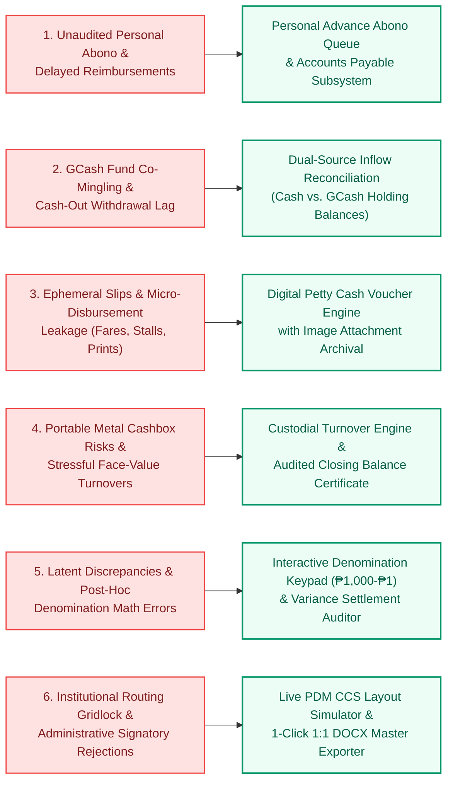

# PROJECT CONTEXT: FINLITE FINANCIAL ASSISTANT SYSTEM
**Academic Course & Requirement:** ITE-SAD (Systems Analysis and Design) | BSIT-31A  
**Host Higher Education Institution:** Pambayang Dalubhasaan ng Marilao (PDM) – College of Computer Studies (CCS)  
**Institutional Classification:** Local College / Local University and College (LUC) | Abangan Norte, Marilao, Bulacan  
**Target Student Organization:** League of Information Technology Enthusiasts (LITE)  
**Project Proponents:** Andrei John P. Geronimo, Christian Rey C. Kasilag (*Technical Writer*), Emanuel Malbarosa, Ervin James Ramos  
**Designated Faculty Club Advisers:** Ms. Kimberly Dawn Jatulan and Ms. Krizia Mae Genovia  
**Institutional Approving Authorities:** BSIT Program Director Jovylyn Ortiz-Cesar, MBA, MSIT; CCS Dean Dr. Emraida Marie M. Manucom  
**Project Title:** **FinLITE: A Web-Based Financial Assistant System for the League of Information Technology Enthusiasts**

---

## 1. NEW SYSTEM OVERVIEW

### 1.1 Conceptual Foundation & The "Financial Assistant" Paradigm
In collegiate academic governance, computerized financial systems frequently fail to achieve operational adoption due to an architectural mismatch: the imposition of heavyweight Enterprise Resource Planning (ERP) frameworks upon volunteer-driven student organizations. Conventional corporate accounting software (e.g., SAP, QuickBooks, or Odoo) mandates rigorous double-entry bookkeeping, multi-layered procurement requisitions, formal chart-of-accounts maintenance, and certified accounting expertise. For academic student organizations operating within local tertiary colleges, such platforms introduce severe cognitive and operational friction. Student officers—elected primarily for leadership and technical capabilities rather than professional bookkeeping proficiency—invariably abandon high-friction platforms, reverting to unstructured paper slips, loose notebooks, and informal mobile messaging threads.

**FinLITE: A Web-Based Financial Assistant System for the League of Information Technology Enthusiasts** resolves this systemic vulnerability by intentionally discarding the rigid ERP paradigm in favor of an **Operational Financial Co-Pilot**. FinLITE is engineered specifically around the empirical constraints of collegiate student leadership at Pambayang Dalubhasaan ng Marilao (PDM). Rather than functioning as an administrative barrier, FinLITE operates as an agile, low-friction, single-entry operational ledger paired with automated cognitive assistance, mathematical verification, and institutional document compilation. It provides student treasurers, auditors, and faculty advisers with an intelligent operational assistant that eliminates manual arithmetic errors, provides continuous visibility over physical and digital funds, and automates institutional report generation without demanding formal accounting credentials.

### 1.2 Core Architectural Capabilities & Modular Subsystems
FinLITE encompasses five purpose-built functional subsystems that systematically digitize and safeguard the organizational treasury:

1. **Role-Gated Security & Financial Segregation of Duties:**
   Access is strictly restricted to an authenticated whitelist of official PDM institutional Google accounts (`@pdm.edu.ph`). FinLITE programmatically enforces institutional **Segregation of Duties (SoD)** across three operational tiers:
   - *The Treasurer* maintains sole custodial authority to record transaction inflows, log operational disbursements, encode digital mobile wallet conversions, and process reimbursement payouts.
   - *The Auditor* possesses independent verification rights to inspect attached receipts, validate petty cash slips, perform physical cash counts, and register audit exceptions without altering original transaction records.
   - *The President and Faculty Club Advisers* maintain administrative oversight, monitoring liquid cash on hand, tracking outstanding liabilities, and authorizing semester-end liquidation statements.

2. **Single-Entry Operational Ledger & Accounts Payable Reimbursement Queue:**
   FinLITE replaces scattered paper receipts with a unified, event-tagged operational ledger. Recognizing that urgent student activities demand immediate out-of-pocket capital, the system incorporates a dedicated **Personal Advance ("Abono") Subsystem**. When faculty advisers or student officers advance their personal funds to purchase event supplies, FinLITE logs the advance as an organizational liability (*Accounts Payable*). The claim remains transparently queued under Auditor verification until the Treasurer disburses physical reimbursement from the organization's funds.

3. **Physical Denomination Counter & Cash Shortage Audit Engine:**
   To bridge the perennial divide between theoretical bookkeeping and physical cash custody, FinLITE provides an interactive denomination calculator spanning Philippine currency denominations (₱1,000, ₱500, ₱200, ₱100, ₱50, and ₱20 banknotes; ₱20, ₱10, ₱5, and ₱1 coins). The system performs continuous reconciliation between physical cash counts and the computed ledger balance. When unavoidable variances occur, the system provides governed accounting mechanisms: minor untraceable coin variances may be formally justified as an allowable **"Cash Shortage"** line item under Adviser approval, while material deficits trigger structured officer liability alerts.

4. **Grounded, Deterministic AI Financial Co-Pilot (Zero-Hallucination Query Engine):**
   FinLITE integrates an intelligent, natural-language query interface capable of parsing inquiries in English and colloquial Filipino/Taglish (e.g., *"Magkano pa ang hindi nare-reimburse kay Ma'am Jatulan?"* or *"What is our net liquidity after Club Week?"*). Crucially, the AI co-pilot operates under strict **deterministic grounding**: it generates read-only Structured Query Language (SQL) aggregations against the verified PostgreSQL database and is strictly prohibited from estimating, extrapolating, or synthesizing mathematical figures. If data does not exist, the assistant explicitly reports its absence, guaranteeing absolute arithmetical integrity.

5. **Automated Institutional Exporter & 1:1 Word (`.docx`) Report Compiler:**
   To resolve the severe administrative bottleneck of end-of-term academic clearances, FinLITE features a live in-browser report simulation engine coupled with a serverless Microsoft Word (`.docx`) compiler. The system compiles live transaction data directly into the approved, standardized College of Computer Studies (CCS) financial layout—faithfully reproducing Times New Roman typography, formal transmittal headers, exact borderless financial tables, and the mandatory six-tier sequential wet-ink signatory block ready for immediate institutional printing and administrative routing.

---

## 2. BACKGROUND OF THE ORGANIZATION

### 2.1 The Host Institution: Pambayang Dalubhasaan ng Marilao (PDM)
**Pambayang Dalubhasaan ng Marilao (PDM)** is a municipal government-funded higher education institution—classified under Philippine educational governance as a **Local College / Local University and College (LUC)**—situated in Barangay Abangan Norte, Marilao, Bulacan. Established pursuant to municipal ordinances to provide accessible, high-quality tertiary education to the youth of Marilao and surrounding municipalities, PDM operates in compliance with the regulatory standards of the Commission on Higher Education (CHED) and the Association of Local Colleges and Universities (ALCU). 

Within PDM’s academic organizational structure, the **College of Computer Studies (CCS)** stands as the premier computing division, dedicated to developing industry-ready technology professionals through its flagship program, the Bachelor of Science in Information Technology (BSIT). The College operates under the executive academic leadership of **Dean Dr. Emraida Marie M. Manucom**, with academic curriculum and student governance overseen by **BSIT Program Director Jovylyn Ortiz-Cesar, MBA, MSIT**.

### 2.2 The Target Student Organization: League of Information Technology Enthusiasts (LITE)
The **League of Information Technology Enthusiasts (LITE)** is the officially accredited academic mother organization representing the entire student body of the College of Computer Studies at PDM. Guided by designated Faculty Club Advisers **Ms. Kimberly Dawn Jatulan** and **Ms. Krizia Mae Genovia**, LITE serves as the primary governing and co-curricular body responsible for orchestrating college-wide technical seminars, programming competitions, e-sports competitions, social development initiatives, and official participation in campus-wide events such as Institutional Club Week.

### 2.3 Governance Structure and Committee Ecosystem
The organizational hierarchy of LITE comprises a multi-tiered leadership structure designed to represent the academic, technical, and cultural interests of BSIT students:
- **The Executive Board:** Consisting of the President, Vice President, Secretary, Treasurer, and Auditor, who collectively direct daily executive, administrative, and financial affairs.
- **Year-Level Representatives:** Elected delegates representing the 1st, 2nd, 3rd, and 4th Year cohorts of the BSIT program, serving as primary communication conduits and fee collection liaisons between the executive board and classroom sections.
- **Nine Specialized Sub-Committees:** Reflecting both technical computing tracks and holistic extracurricular disciplines, led by appointed Committee Chairpersons:
  1. *Arduino Sub-Committee:* Oversees embedded systems, robotics, micro-controller prototyping, and Internet of Things (IoT) workshops.
  2. *Cybersecurity Sub-Committee:* Directs information assurance seminars, ethical hacking bootcamps, and defensive networking configurations.
  3. *Programming Sub-Committee:* Manages algorithmic coding competitions, software development hackathons, and peer-to-peer programming tutorials.
  4. *Networking Sub-Committee:* Facilitates physical infrastructure workshops, packet routing demonstrations, and Cisco hardware simulation sessions.
  5. *Multimedia Sub-Committee:* Drives visual asset design, digital branding, promotional campaign rendering, and UI/UX layouts.
  6. *Photography Sub-Committee:* Provides photographic documentation, live event coverage, and multimedia archival of college activities.
  7. *E-sports Sub-Committee:* Organizes competitive gaming tournaments, live-streamed broadcasts, and student team logistics.
  8. *Singing Sub-Committee:* Coordinates vocal performances, anthems, and musical presentations for official institutional convocations.
  9. *Dancing Sub-Committee:* Directs choreography, cultural presentations, and performance arts for campus-wide festivals.

### 2.4 Operational Setting, Venue Constraints, and Custodial Protocols
Unlike administrative offices of the institution, LITE operates under severe collegiate physical constraints:
- **Absence of Dedicated Office Infrastructure:** LITE possesses no dedicated physical office, private conference space, or institutional desktop workstation. Administrative planning, dues collection, and liquidation deliberations occur transiently across campus corridors, student lounges, event booths, or within the **2nd-floor faculty room**.
- **Custodial Base at Adviser's Desk:** Official record archives and physical assets are centralized exclusively at the **faculty room / adviser's desk** on the second floor of the PDM academic building. All official financial consultations, physical audit sessions, and ledger inspections are conducted at this specific faculty station.
- **Physical Money Custody via Small Metal Cashbox:** All physical cash holdings, petty cash reserves, and accumulated coin collections are stored inside a single **small metal cashbox**. For physical security and institutional accountability, this small metal cashbox is housed inside a locked drawer at the adviser's desk in the faculty room. It is retrieved exclusively by authorized officers during scheduled collection drives, campus events, or formal audit reconciliations.
- **Strict Face-Value Annual Turnover Handoff Protocol:** Organizational leadership transitions occur annually at the conclusion of the academic year. Incoming student officers do not commence operations from a null balance; they inherit the physical small metal cashbox, physical receipt archives, and the carried-over cash surplus certified in the audited Final Financial Report of the outgoing administration. Crucially, institutional tradition and departmental oversight enforce a **strict face-value turnover protocol**: the physical cash contained within the small metal cashbox must match the exact numerical face value attested on the signed report. Under no circumstances may an administration hand over an unresolved ledger deficit. If an unverified cash shortage exists at the close of the academic year, outgoing custodians are required to cover the missing balance out-of-pocket (*"abono"*) before the incoming administration will execute the transfer of custodial responsibility.

---

## 3. BUSINESS LOGIC (THE AS-IS FINANCIAL OPERATIONS & WORKFLOWS)

The operational financial lifecycle of LITE encompasses five interdependent business processes, governing capital inflows, out-of-pocket disbursements, receipt validations, cashbox reconciliations, and institutional administrative clearances.

### 3.1 Revenue Generation and Inflow Processing Logic
Financial inflows into LITE originate from four primary operational activities:
1. *Academic Membership Dues & Merchandise Sales:* Periodic collection of membership fees, departmental lanyards, and official LITE organizational t-shirts.
2. *Event & Competition Registration Fees:* Registration fees collected for competitive computing brackets (e.g., E-sports tournaments, programming hackathons, cybersecurity challenges).
3. *Commercial Booth Proceeds:* Concession, merchandise, and recreational booth revenues generated during campus-wide celebrations such as Institutional Club Week.
4. *Carried-Over Surplus Reserves:* Certified cash balances transferred from the preceding academic administration under the face-value handoff protocol.

These inflows traverse two distinct physical and digital collection channels:
- **Direct Physical Cash Inflow:** Physical currency collected directly by the Treasurer or designated Year-Level Representatives at collection desks. Collected cash is directly transported to the 2nd-floor faculty room and placed inside the small metal cashbox.
- **Digital GCash Inflow via Ad-Hoc Pooling:** Because student organizations at the local college level cannot legally secure institutional merchant accounts with commercial financial technology providers, digital payments (which constitute an increasingly high percentage of student transactions) are collected through personal GCash mobile wallets. Inflows are temporarily pooled into the personal mobile wallet of **whomever is available on duty**—principally the personal account of the **Club Adviser/s**, or the designated student officer managing the collection desk. 
- **Cash-Out & Replenishment Logic:** Digital funds accumulated in personal mobile wallets do not instantly reflect inside the small metal cashbox. The holder must execute a manual cash-out transaction via automated teller machines, convenience marts, or local pawnshops—frequently absorbing third-party transaction fees (e.g., ₱15 to ₱20 per withdrawal). Once liquidated, the physical currency is manually remitted to the Treasurer to replenish the physical cashbox, creating a temporal latency between digital payment confirmation and physical cash custody.

### 3.2 Spending Authorization and Out-of-Pocket Personal Advances ("Abono")
Activity operational budgets (e.g., procurement of decorative craft items, certificate paper, satin sashes, acrylic trophies, guest judge honorarium tokens, and committee refreshments) are established through informal, ad-hoc administrative channels. Spending authorizations are typically approved via verbal discussions or unstructured instant messaging threads (Messenger group chats) between the Executive Board and the Faculty Club Advisers.

Because the small metal cashbox is secured inside the faculty room locked drawer and cannot be freely transported off campus during purchasing expeditions, upfront petty cash disbursements are rarely feasible. Consequently, the operational lifecycle of LITE relies fundamentally on the **Personal Advance ("Abono") Mechanism**:
- **Personal Capital Advances:** Both **Faculty Club Advisers and Student Executive Officers** routinely advance personal financial resources out of their personal salaries, student allowances, or personal wallets to procure urgent materials for LITE activities.
- **Accounts Payable Status:** From the instant personal capital is expended, the transaction represents an unliquidated organizational debt (*Accounts Payable*). The individual advancing the funds retains the physical receipt or expense proof, awaiting cash reimbursement.

### 3.3 Expense Documentation, Micro-Disbursement Acknowledgment, and Reimbursement Protocol
The liquidation and settlement of personal advances follow a strict receipt-gated operational protocol:
- **Commercial Purchases:** For procurement conducted at commercial retail establishments, supermarkets, or registered printing presses, claimants must present official printed commercial receipts or machine-validated sales invoices.
- **Non-Receipted Micro-Disbursements:** A substantial portion of student organization operational spending involves informal micro-transactions where formal commercial receipts are legally and practically unobtainable. These specifically include:
  - Local public transit fares (*jeepney and tricycle travel*) incurred while transporting supplies between campus and procurement centers.
  - Raw crafting and decoration materials purchased from informal neighborhood market stalls.
  - Emergency thesis and documentation printing conducted at local, informal computer rental shops.
- **Petty Cash Acknowledgment Slips:** To validate non-receipted micro-disbursements, LITE enforces a manual acknowledgment protocol. The purchasing officer must draft a handwritten petty cash acknowledgment slip specifying the date, exact monetary expenditure, vehicular route or item description, and signature of the purchasing officer, supplemented whenever feasible by photographic proof or message screenshots forwarded to the Executive Board chat.
- **Reimbursement Execution:** The claimant submits the compiled physical receipts and acknowledgment slips to the Auditor. Upon the Auditor’s verification of arithmetical accuracy and validity, the document is endorsed to the Treasurer. The Treasurer extracts the corresponding physical currency from the small metal cashbox and disburses the cash reimbursement, formally extinguishing the out-of-pocket advance.

### 3.4 Physical Denomination Counting and Cash Variance Settlement Logic
Financial audits are conducted periodically at the adviser's desk in the 2nd-floor faculty room, typically preceding major event closeouts and semester-end liquidations. The verification procedure requires a complete **Physical Denomination Count**:
- **Systematic Bill and Coin Breakdown:** The Auditor and Treasurer extract all physical cash from the small metal cashbox and categorize the physical currency into standard Philippine denomination brackets:
  $$\text{Banknotes: } ₱1,000,\ ₱500,\ ₱200,\ ₱100,\ ₱50,\ ₱20 \quad\Big|\quad \text{Coins: } ₱20,\ ₱10,\ ₱5,\ ₱1$$
- **Reconciliation Mathematical Logic:** The total counted physical cash is balanced against theoretical book records:
  $$\text{Theoretical Ledger Balance} = \text{Opening Carryover Balance} + \sum \text{Inflows} - \sum \text{Reimbursed Disbursements}$$
  $$\text{Discrepancy Variance} = \text{Total Counted Physical Cash} - \text{Theoretical Ledger Balance}$$
- **Variance Handling Rules:**
  - *Zero Variance:* Theoretical records match physical currency exactly; records are certified balanced.
  - *Minor Untraceable Cash Shortage:* Due to untraceable fractional change discrepancies or unrecorded loose coin losses during rapid booth transactions, minor variances occasionally emerge. In accordance with historical departmental precedent (such as the **₱161.00 Cash Shortage** documented and approved during the AY 2025–2026 liquidation), minor untraceable shortfalls may be formally declared on the financial statement as an allowable operating expense line item labeled *"Cash Shortage"*, requiring written justification by the Treasurer and formal concurrence by the Club Advisers.
  - *Material Unjustified Discrepancies:* If a discrepancy exceeds minor allowable thresholds or cannot be justified through operational context, the deficit must be covered out-of-pocket (*"abono"*) by the responsible custodial officers to preserve the face-value integrity of the organization's funds.

### 3.5 Institutional Liquidation Standards and Sequential Wet-Ink Signatory Routing
At the termination of each academic term, LITE must prepare and submit an exhaustive, institutional-grade Final Financial Liquidation Report. The document must strictly adhere to the formatting and typographical mandates established by the College of Computer Studies:
- **Format Rigidity:** The statement must be formatted in Times New Roman typography, utilizing standardized institutional margins, exact borderless table hierarchies for itemized schedules, and formal transmittal headers addressed to the College leadership.
- **Sequential 6-Tier Wet-Ink Routing Chain:** Once drafted and verified, the report must be printed on official hard-copy institutional bond paper and physically routed across campus through six sequential administrative authorities. Each signatory must review, verify, and execute a physical wet-ink signature in strict, unbroken hierarchy:

$$\text{1. Treasurer} \longrightarrow \text{2. Auditor} \longrightarrow \text{3. President} \longrightarrow \text{4. Club Advisers} \longrightarrow \text{5. BSIT Program Director} \longrightarrow \text{6. CCS Dean}$$

| Stage | Signatory Authority | Institutional Governance Role |
| :---: | :--- | :--- |
| **Stage 1** | **LITE Treasurer** | Prepares and certifies numerical accuracy of records |
| **Stage 2** | **LITE Auditor** | Verifies receipts, vouchers, and physical cashbox balance |
| **Stage 3** | **LITE President** | Attests executive alignment and endorses formal submission |
| **Stage 4** | **Faculty Club Advisers** *(Ms. Jatulan & Ms. Genovia)* | Reviews custodial compliance and officially endorses to the department |
| **Stage 5** | **BSIT Program Director** *(Jovylyn Ortiz-Cesar, MBA, MSIT)* | Departmental administrative review and recommendation for college approval |
| **Stage 6** | **Dean, College of Computer Studies** *(Dr. Emraida Marie M. Manucom)* | Executive academic clearance; validates student organization clearance |

- **Institutional Rejection Protocol:** The review chain enforces zero tolerance for arithmetical discrepancies, receipt omissions, or layout defects. If the BSIT Program Director or College Dean detects a single computational mismatch, unverified voucher line, or improper margin alignment, the document is immediately rejected. The officers must re-compute, re-edit, re-print, and completely restart the physical wet-ink signing process from Stage 1, creating severe administrative bottlenecks that threaten semester clearance and student graduation sign-offs.

---

## 4. PROBLEMS IN THE BUSINESS LOGIC

Primary field interviews with executive officers across successive administrations (spanning tenure as Auditor, Treasurer, and President from 2024 to 2026), corroborated by adviser questionnaires, reveal six critical operational failure modes within LITE’s current manual business logic:

| Operational Failure Mode | Root Cause & Institutional Consequence | Severity |
| :--- | :--- | :---: |
| **1. Personal Abono Vulnerability & Queuing Delays** | Out-of-pocket funding by faculty advisers and officers creates personal financial liabilities when loose paper receipts are crumpled, faded, or misplaced. | **CRITICAL** |
| **2. Digital Inflow Co-Mingling & Cash-Out Lag** | Accepting dues via personal GCash accounts causes holding lag, personal/club fund commingling, unrecorded withdrawal fees, and temporary ledger drift. | **HIGH** |
| **3. Ephemeral Documentation & Micro-Disbursement Leakage** | Loose paper slips and Messenger chats result in missing metadata for informal transit and rush print expenses, causing audit disagreement and unliquidated leakage. | **HIGH** |
| **4. Physical Cashbox Custodial Vulnerability & Turnover Stress** | Storing physical funds in a portable metal box without real-time logs forces outgoing officers to shoulder year-end deficits under the strict face-value handoff protocol. | **CRITICAL** |
| **5. Latent Discrepancies & Post-Hoc Reconciliation Bottlenecks** | Physical denomination counts happen weeks after events; arithmetic errors remain undetected until final reporting, creating chaotic audit sessions. | **HIGH** |
| **6. Institutional Routing Gridlock & Signatory Rejection Risks** | Formatting defects or math errors trigger rejection by the Program Director or Dean, restarting the 6-stage physical wet-ink routing and stalling clearances. | **CRITICAL** |

### 4.1 Personal Financial Vulnerability and Delayed Reimbursement of "Abono"
Because LITE cannot maintain pre-disbursed operational bank accounts, **both faculty club advisers and student executive officers routinely advance personal funds** to cover critical operational expenses. During fast-paced events such as Institutional Club Week, advisers and officers frequently expend thousands of pesos of their personal income for competition tokens, student food, certificates, and booth materials and supplies. 
- Settling these personal advances requires navigating an unstandardized, receipt-gated reimbursement queue.
- Thermal paper receipts gathered during stressful campus events frequently fade, become crumpled in pockets, or are misplaced entirely.
- When an original receipt is lost, the expenditure cannot be officially audited. Consequently, faculty advisers and student officers are forced to absorb these expenses out-of-pocket, transforming volunteer academic service into personal financial liability.

### 4.2 Co-Mingling of Personal and Organizational Capital via Ad-Hoc GCash Pooling
The reliance on personal mobile wallets (predominantly belonging to the **Club Adviser/s**, or the designated student on duty) to capture digital collections introduces severe internal control vulnerabilities:
- Organizational funds sit directly co-mingled with personal savings, creating significant risks of accidental personal spending.
- The temporal lag between receiving a digital payment and executing a physical cash-out produces **"ledger drift"**: digital transaction records show funds as collected, but the physical small metal cashbox lacks the corresponding cash on hand.
- Third-party withdrawal service fees (e.g., ₱15.00–₱20.00 cash-out surcharges) are rarely logged consistently, creating recurring minor cash deficits that compound over the academic year.

### 4.3 Ephemeral Documentation and Administrative Leakage in Non-Receipted Micro-Disbursements
A vast proportion of collegiate event expenditures consists of non-receipted micro-disbursements—specifically jeepney and tricycle transportation fares between campus and supply vendors, raw craft purchases from local public markets, and emergency photocopies or printouts from campus stalls. 
- Under the current manual system, these transactions are documented through loose scraps of paper, informal sticky notes, or unstructured screenshots within Messenger group chats.
- These loose paper slips lack standardized metadata (exact timestamps, itemized descriptions, authorized claimant IDs, and supervising officer endorsements).
- Over a multi-month semester, paper slips are easily mislaid or smudged, depriving the Auditor of verifiable audit trails and resulting in unliquidated expense leakage.

### 4.4 Physical Cashbox Custodial Risks and High-Stress Face-Value Turnover Obligations
Physical cash custody governed by a portable small metal cashbox stored in a faculty room drawer presents continuous custodial exposure:
- During hectic campus-wide activities, the metal cashbox is carried to outdoor booths or student corridors, exposing it to theft, misplacement, or unmonitored coin change distribution.
- Under the mandatory **strict face-value turnover handoff protocol**, incoming administrations will not accept organizational custody if the physical cash inside the box deviates by even a single peso from the final audited balance.
- Because transaction tracking is currently performed post-hoc on loose paper, historical errors accumulate invisibly. At the end of the academic year, the outgoing Treasurer and Auditor face severe personal stress, frequently compelled to pay out-of-pocket (*"abono"*) to rectify accumulated year-long balance discrepancies before receiving graduation or leadership clearance.

### 4.5 Latent Discrepancies and Arithmetical Reconciliation Bottlenecks
Physical cash reconciliations are rarely conducted on a daily or event-by-event cadence. Instead, physical denomination counts (sorting bills from ₱1,000 down to coins of ₱1) are performed weeks or months after events conclude.
- In the absence of an automated reconciliation tool, the Treasurer and Auditor must perform manual cross-multiplication of currency counts against loose paper expenditure tallies.
- Arithmetic errors in manual calculations mask discrepancies until the final semester report is assembled.
- When cash variances do emerge, officers cannot determine whether the disparity represents an unrecorded GCash cash-out, an unlogged petty micro-disbursement, or an untraceable coin variance (such as the historical ₱161.00 cash shortage), preventing timely operational remediation.

### 4.6 Institutional Liquidation Bottlenecks and Signatory Rejections
The preparation of the end-of-term Final Financial Report is currently conducted through rudimentary word processors or manual spreadsheets. This process represents an acute operational bottleneck:
- Student officers struggle to reproduce the exacting layout standards demanded by the College of Computer Studies, frequently producing uneven table borders, misaligned decimal figures, inconsistent Times New Roman font sizings, and incorrectly formatted transmittal memoranda.
- The physical routing workflow requires navigating **six sequential wet-ink signatories**:
  $$\text{Treasurer} \longrightarrow \text{Auditor} \longrightarrow \text{President} \longrightarrow \text{Club Advisers} \longrightarrow \text{BSIT Program Director} \longrightarrow \text{CCS Dean}$$
- If a calculation error, missing receipt attachment, or typographical defect is identified by Program Director Jovylyn Ortiz-Cesar or Dean Dr. Emraida Marie M. Manucom at the fifth or sixth stage, the report is summarily rejected. The officers must manually correct the error, reprint the entire multi-page document on hard-copy institutional bond paper, and physically re-route the document from the Treasurer onward. During final examination weeks and graduation clearance periods, this recurring routing gridlock creates immense administrative stress and paralyzes institutional operations.

---

## 5. BRIDGE TO PROJECT SCOPE (MATRIX & ARCHITECTURAL TRACEABILITY)

To ensure comprehensive systems analysis alignment, the identified operational failure modes within LITE's business logic are directly mapped to FinLITE’s functional software modules, governance mechanisms, and architectural solutions. This traceability matrix establishes the precise functional scope required to resolve each real-world vulnerability.

### 5.1 Business Logic Problems vs. System Capabilities Traceability Matrix

| Identified Problem in Business Logic | Root Operational Failure Mode | FinLITE Functional Module & Architectural Capability | Specific Operational Mechanism & Institutional Governance Impact |
| :--- | :--- | :--- | :--- |
| **1. Personal Abono Vulnerability & Delayed Reimbursements** | Advisers and officers shoulder urgent out-of-pocket event costs but suffer personal loss when paper receipts fade or are lost. | **Personal Advance ("Abono") & Reimbursement Queue Management Module** | • Dedicated Accounts Payable ledger. • Tracks claimant name, timestamp, amount, and attached digital receipt proof. • Automated Auditor review & Treasurer payout status; zero lost personal funds. |
| **2. Digital Inflow GCash Co-Mingling & Cash-Out Lag** | Digital payments pooled into personal wallets of whoever is on duty, causing ledger drift and unlogged withdrawal fees. | **Digital Mobile Inflow & GCash Liquidation Reconciliation Module** | • Explicit transaction tagging for GCash dues. • Logs temporary holding custodian (Adviser / officer) and tracked cash-out balances. • Deducts withdrawal fees; reconciles cashbox replenishment to eliminate ledger drift. |
| **3. Ephemeral Documentation & Micro-Disbursement Leakage** | Fares (jeepney/tricycle), local craft stalls, and emergency printing lack commercial receipts and rely on loose paper scraps. | **Unified Transaction Ledger & Digital Petty Cash Voucher Engine** | • Standardized input modal capturing non-receipted transit, supplies, and printing. • Digital image attachment of handwritten petty cash acknowledgment slips and photos. • Permanent immutable audit trail in DB. |
| **4. Physical Cashbox Custodial Vulnerability & Face-Value Turnover Stress** | Funds held in small metal cashbox in faculty room; outgoing team forced to shoulder missing cash at year-end turnover. | **Custodial Turnover & Multi-Year Balance Certification Engine** | • Automated session-based transaction logging. • Freezes historical academic year ledgers. • Generates audited Closing Balance Transmittal Certificate, guaranteeing exact face-value handoff without officer abono stress. |
| **5. Latent Discrepancies & Post-Hoc Reconciliation Bottlenecks** | Physical cash counts (₱1,000 down to ₱1) are done manually months late; math errors hide variances until final report submission. | **Interactive Denomination Counter & Variance Settlement Audit Engine** | • Digital denomination keypad (₱1,000 to ₱1). • Instant cross-calculation against theoretical book ledger balance. • Governed options: declare allowable "Cash Shortage" or log structured officer abono. |
| **6. Institutional Routing Gridlock & Signatory Rejections** | Manual Word/spreadsheet reports deviate from CCS standards, triggering rejection across the 6-tier wet-ink signatory chain. | **Live College Layout Simulator & 1:1 Institutional DOCX Report Exporter Engine** | • Live in-browser report rendering strictly matching PDM College of Computer Studies. • 1-click export of verified Word (`.docx`) document with borderless tables and exact sequential 6-stage wet-ink signatory lines. |
| *** Cross-Cutting Operational Intelligence** | Officers struggle to quickly extract financial figures during executive meetings or audits. | **Grounded Natural-Language AI Financial Co-Pilot (Zero-Hallucination Engine)** | • Conversational Taglish/English NLP query interface for instant mobile status checks. • 100% database-grounded SQL calculations; strict zero-hallucination arithmetic. |

### 5.2 Architectural Synthesis & Functional Module Description

1. **Role-Gated Security, PDM Google OAuth, and Segregation of Duties:**
   - Enforces zero unauthorized entry through an institutional domain whitelist (`@pdm.edu.ph`).
   - Distinct system permissions prevent the centralization of financial power: Treasurers cannot audit their own transactions; Auditors cannot unilaterally disburse funds; Advisers maintain oversight and authorization authority.

2. **Personal Advance ("Abono") & Accounts Payable Tracking Subsystem:**
   - Instantiates an auditable state machine for all out-of-pocket expenditures incurred by faculty advisers and student leaders:
     $$\text{Status: } [\text{Submitted}] \longrightarrow [\text{Under Auditor Inspection}] \longrightarrow [\text{Approved}] \longrightarrow [\text{Reimbursed Payout}]$$
   - Ensures full protection of personal finances for Ms. Jatulan, Ms. Genovia, and the student officers by maintaining a visible record of unreimbursed advances until physical cashbox settlement is confirmed.

3. **Digital Mobile Inflow (GCash) & Petty Micro-Disbursement Voucher Subsystem:**
   - Features structured input forms that accommodate both commercial receipts and handwritten petty cash acknowledgment slips for tricycle fares, raw craft supplies, and emergency printing.
   - Provides designated holding-account tracking for digital GCash balances, capturing withdrawal transaction fees and prompting physical cashbox replenishment to prevent ledger drift.

4. **Physical Denomination Counter & Variance Settlement Audit Engine:**
   - Provides an intuitive, visual currency calculator spanning all legal tender denominations in the Philippines (₱1,000, ₱500, ₱200, ₱100, ₱50, ₱20 bills; ₱20, ₱10, ₱5, ₱1 coins).
   - Automatically computes total physical liquidity and matches it in real time against system ledger balances.
   - Embeds institutional governance policies for discrepancy resolution: allows the formal justification of allowable minor shortfalls (such as the verified ₱161.00 shortage) as approved expense line items, or guides custodians through structured liability settlement prior to annual leadership turnover.

5. **Institutional 1:1 DOCX Master Exporter & 6-Stage Wet-Ink Routing Generator:**
   - Eliminates formatting rejections by automating document compilation directly from verified database records into a pixel-perfect, 1:1 Microsoft Word (`.docx`) file.
   - Pre-populates formal transmittal metadata, borderless financial schedules, itemized disbursement summaries, and the exact six-tier sequential wet-ink signatory blocks:
     $$\text{Treasurer} \longrightarrow \text{Auditor} \longrightarrow \text{President} \longrightarrow \text{Club Advisers} \longrightarrow \text{BSIT Program Director} \longrightarrow \text{CCS Dean}$$
   - Guarantees immediate, error-free institutional clearance and protects students and advisers from administrative gridlock.

6. **Grounded Natural-Language AI Financial Co-Pilot:**
   - Powers frictionless mobile interaction for officers and advisers via Taglish-capable conversational querying (e.g., *"Ilan pa ang pending reimbursement para sa Club Week?"*).
   - Architecturally restricted to deterministic database aggregations, guaranteeing that every response is 100% mathematically grounded in verified database tables with zero hallucination.

---
*End of Manuscript. Prepared for direct technical integration and final documentation compilation by Christian Rey C. Kasilag (Technical Writer).*
