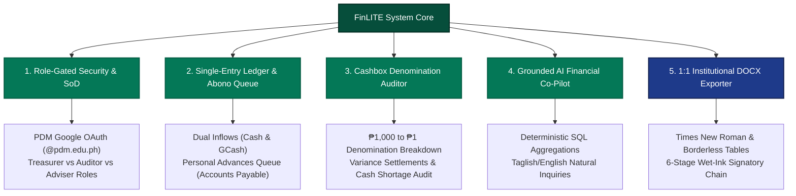
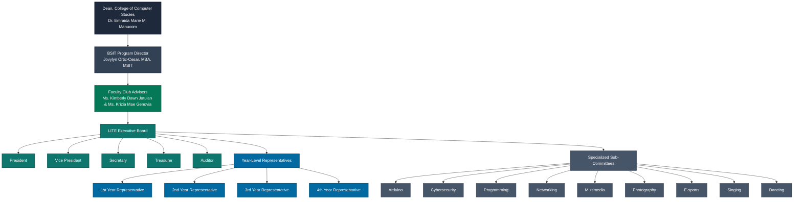
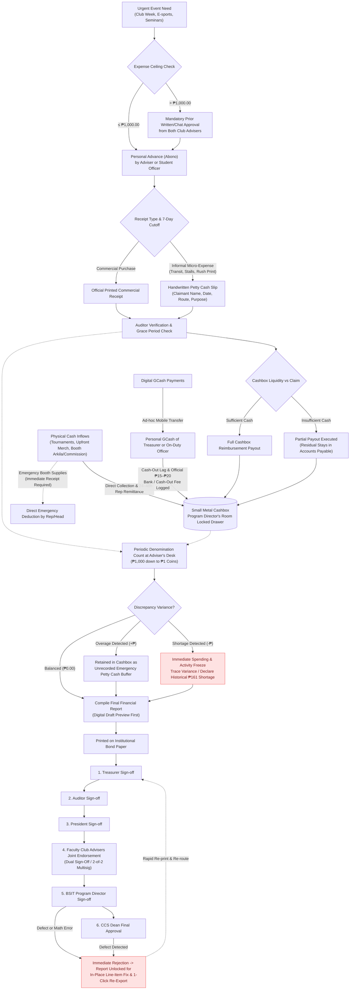
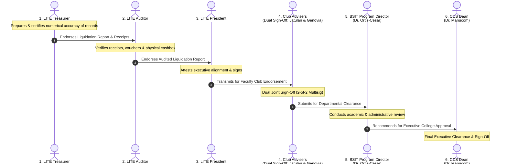
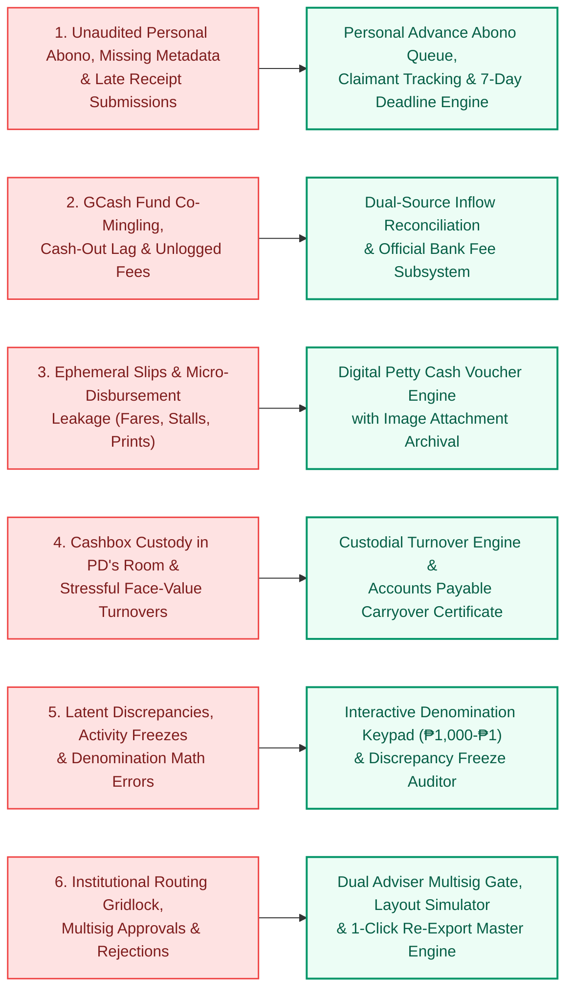

# PROJECT CONTEXT: FINLITE FINANCIAL ASSISTANT SYSTEM
**Academic Course & Requirement:** ITE-SAD (Systems Analysis and Design) | BSIT-31A  
**Host Higher Education Institution:** Pambayang Dalubhasaan ng Marilao (PDM) – College of Computer Studies (CCS)  
**Institutional Classification:** Local College / Local University and College (LUC) | Abangan Norte, Marilao, Bulacan  
**Target Student Organization:** League of Information Technology Enthusiasts (LITE)  
**Project Proponents:** Andrei John P. Geronimo, Christian Rey C. Kasilag (*Technical Writer*), Emanuel Malbarosa, Ervin James Ramos  
**Designated Faculty Club Advisers:** Ms. Kimberly Dawn Jatulan and Ms. Krizia Mae Genovia  
**Institutional Approving Authorities:** BSIT Program Director Jovylyn Ortiz-Cesar, MBA, MSIT; CCS Dean Dr. Emraida Marie M. Manucom  
**Project Title:** **FinLITE: A Web-Based Financial Assistant System for the League of Information Technology Enthusiasts**

---

## 1. NEW SYSTEM OVERVIEW

### 1.1 Conceptual Foundation & The "Financial Assistant" Paradigm
In collegiate academic governance, computerized financial systems frequently fail to achieve operational adoption due to an architectural mismatch: the imposition of heavyweight Enterprise Resource Planning (ERP) frameworks upon volunteer-driven student organizations. Conventional corporate accounting software (e.g., SAP, QuickBooks, or Odoo) mandates rigorous double-entry bookkeeping, multi-layered procurement requisitions, formal chart-of-accounts maintenance, and certified accounting expertise. For academic student organizations operating within local tertiary colleges, such platforms introduce severe cognitive and operational friction. Student officers—elected primarily for leadership and technical capabilities rather than professional bookkeeping proficiency—invariably abandon high-friction platforms, reverting to unstructured paper slips, loose notebooks, and informal mobile messaging threads.

**FinLITE: A Web-Based Financial Assistant System for the League of Information Technology Enthusiasts** resolves this systemic vulnerability by intentionally discarding the rigid ERP paradigm in favor of an **Operational Financial Co-Pilot**. FinLITE is engineered specifically around the empirical constraints of collegiate student leadership at Pambayang Dalubhasaan ng Marilao (PDM). Rather than functioning as an administrative barrier, FinLITE operates as an agile, low-friction, single-entry operational ledger paired with automated cognitive assistance, mathematical verification, and institutional document compilation. It provides student treasurers, auditors, and faculty advisers with an intelligent operational assistant that eliminates manual arithmetic errors, provides continuous visibility over physical and digital funds, and automates institutional report generation without demanding formal accounting credentials.

### 1.2 Core Architectural Capabilities & Modular Subsystems
FinLITE encompasses five purpose-built functional subsystems that systematically digitize and safeguard the organizational treasury:

1. **Role-Gated Security & Financial Segregation of Duties:**
   Access is strictly restricted to an authenticated whitelist of official PDM institutional Google accounts (`@pdm.edu.ph`). FinLITE programmatically enforces institutional **Segregation of Duties (SoD)** across three operational tiers:
   - *The Treasurer* maintains sole custodial authority to record transaction inflows, log operational disbursements, encode digital mobile wallet conversions, and process reimbursement payouts.
   - *The Auditor* possesses independent verification rights to inspect attached receipts, validate petty cash slips, perform physical cash counts, and register audit exceptions without altering original transaction records.
   - *The President and Faculty Club Advisers* maintain administrative oversight, monitoring liquid cash on hand, tracking outstanding liabilities, and authorizing semester-end liquidation statements.

2. **Single-Entry Operational Ledger & Accounts Payable Reimbursement Queue:**
   FinLITE replaces scattered paper receipts with a unified, event-tagged operational ledger. Recognizing that urgent student activities demand immediate out-of-pocket capital, the system incorporates a dedicated **Personal Advance ("Abono") Subsystem**. When faculty advisers or student officers advance their personal funds to purchase event supplies, FinLITE logs the advance as an organizational liability (*Accounts Payable*). The claim remains transparently queued under Auditor verification until the Treasurer disburses physical reimbursement from the organization's funds.

3. **Physical Denomination Counter & Cash Shortage Audit Engine:**
   To bridge the perennial divide between theoretical bookkeeping and physical cash custody, FinLITE provides an interactive denomination calculator spanning Philippine currency denominations (₱1,000, ₱500, ₱200, ₱100, ₱50, and ₱20 banknotes; ₱20, ₱10, ₱5, and ₱1 coins). The system performs continuous reconciliation between physical cash counts and the computed ledger balance. When unavoidable variances occur, the system provides governed accounting mechanisms: minor untraceable coin variances may be formally justified as an allowable **"Cash Shortage"** line item under Adviser approval, while material deficits trigger structured officer liability alerts.

4. **Grounded, Deterministic AI Financial Co-Pilot (Zero-Hallucination Query Engine):**
   FinLITE integrates an intelligent, natural-language query interface capable of parsing inquiries in English and colloquial Filipino/Taglish (e.g., *"Magkano pa ang hindi nare-reimburse kay Ma'am Jatulan?"* or *"What is our net liquidity after Club Week?"*). Crucially, the AI co-pilot operates under strict **deterministic grounding**: it generates read-only Structured Query Language (SQL) aggregations against the verified PostgreSQL database and is strictly prohibited from estimating, extrapolating, or synthesizing mathematical figures. If data does not exist, the assistant explicitly reports its absence, guaranteeing absolute arithmetical integrity.

5. **Automated Institutional Exporter & 1:1 Word (`.docx`) Report Compiler:**
   To resolve the severe administrative bottleneck of end-of-term academic clearances, FinLITE features a live in-browser report simulation engine coupled with a serverless Microsoft Word (`.docx`) compiler. The system compiles live transaction data directly into the approved, standardized College of Computer Studies (CCS) financial layout—faithfully reproducing Times New Roman typography, formal transmittal headers, exact borderless financial tables, and the mandatory six-tier sequential wet-ink signatory block ready for immediate institutional printing and administrative routing.

---

## 2. BACKGROUND OF THE ORGANIZATION

### 2.1 The Host Institution: Pambayang Dalubhasaan ng Marilao (PDM)
**Pambayang Dalubhasaan ng Marilao (PDM)** is a municipal government-funded higher education institution—classified under Philippine educational governance as a **Local College / Local University and College (LUC)**—situated in Barangay Abangan Norte, Marilao, Bulacan. Established pursuant to municipal ordinances to provide accessible, high-quality tertiary education to the youth of Marilao and surrounding municipalities, PDM operates in compliance with the regulatory standards of the Commission on Higher Education (CHED) and the Association of Local Colleges and Universities (ALCU). 

Within PDM’s academic organizational structure, the **College of Computer Studies (CCS)** stands as the premier computing division, dedicated to developing industry-ready technology professionals through its flagship program, the Bachelor of Science in Information Technology (BSIT). The College operates under the executive academic leadership of **Dean Dr. Emraida Marie M. Manucom**, with academic curriculum and student governance overseen by **BSIT Program Director Jovylyn Ortiz-Cesar, MBA, MSIT**.

### 2.2 The Target Student Organization: League of Information Technology Enthusiasts (LITE)
The **League of Information Technology Enthusiasts (LITE)** is the officially accredited academic mother organization representing the entire student body of the College of Computer Studies at PDM. Guided by designated Faculty Club Advisers **Ms. Kimberly Dawn Jatulan** and **Ms. Krizia Mae Genovia**, LITE serves as the primary governing and co-curricular body responsible for orchestrating college-wide technical seminars, programming competitions, e-sports competitions, social development initiatives, and official participation in campus-wide events such as Institutional Club Week.

### 2.3 Governance Structure and Committee Ecosystem
The organizational hierarchy of LITE comprises a multi-tiered leadership structure designed to represent the academic, technical, and cultural interests of BSIT students:
- **The Executive Board:** Consisting of the President, Vice President, Secretary, Treasurer, and Auditor, who collectively direct daily executive, administrative, and financial affairs.
- **Year-Level Representatives:** Elected delegates representing the 1st, 2nd, 3rd, and 4th Year cohorts of the BSIT program, serving as primary communication conduits and fee collection liaisons between the executive board and classroom sections.
- **Nine Specialized Sub-Committees:** Reflecting both technical computing tracks and holistic extracurricular disciplines, led by appointed Committee Chairpersons:
  1. *Arduino Sub-Committee:* Oversees embedded systems, robotics, micro-controller prototyping, and Internet of Things (IoT) workshops.
  2. *Cybersecurity Sub-Committee:* Directs information assurance seminars, ethical hacking bootcamps, and defensive networking configurations.
  3. *Programming Sub-Committee:* Manages algorithmic coding competitions, software development hackathons, and peer-to-peer programming tutorials.
  4. *Networking Sub-Committee:* Facilitates physical infrastructure workshops, packet routing demonstrations, and Cisco hardware simulation sessions.
  5. *Multimedia Sub-Committee:* Drives visual asset design, digital branding, promotional campaign rendering, and UI/UX layouts.
  6. *Photography Sub-Committee:* Provides photographic documentation, live event coverage, and multimedia archival of college activities.
  7. *E-sports Sub-Committee:* Organizes competitive gaming tournaments, live-streamed broadcasts, and student team logistics.
  8. *Singing Sub-Committee:* Coordinates vocal performances, anthems, and musical presentations for official institutional convocations.
  9. *Dancing Sub-Committee:* Directs choreography, cultural presentations, and performance arts for campus-wide festivals.

### 2.4 Operational Setting, Venue Constraints, and Custodial Protocols
Unlike administrative offices of the institution, LITE operates under severe collegiate physical constraints:
- **Absence of Dedicated Office Infrastructure:** LITE possesses no dedicated physical office, private conference space, or institutional desktop workstation. Administrative planning, event coordination, and liquidation deliberations occur transiently across campus corridors, student lounges, event booths, or within the **2nd-floor faculty room**.
- **Custodial Base & Financial Consultation Station:** Official record archives, physical audit sessions, and ledger consultations are conducted at the **faculty room / adviser's desk** on the second floor of the PDM academic building.
- **Physical Money Custody in Program Director's (PD's) Room:** All physical cash holdings, petty cash reserves, and accumulated coin collections are secured inside a single **small metal cashbox**. Certified institutional policy dictates that the cashbox is stored inside a locked drawer within the **Program Director's (PD's) Room** (the executive office of BSIT Program Director Jovylyn Ortiz-Cesar, MBA, MSIT). It is retrieved exclusively by authorized officers during scheduled collection drives, campus events, or formal audit reconciliations.
- **Strict Campus Boundary for Physical Cashbox:** The small metal cashbox **never leaves the PDM campus**. During weekend events or off-campus purchasing expeditions (e.g., procurement of decorative materials, hardware components, or certificates at commercial centers), the cashbox remains secured inside the PD's room. All off-campus purchases must be funded via out-of-pocket personal advances (*"abono"*) by officers or advisers, which are formally liquidated and reimbursed upon return to campus.
- **Strict Face-Value Annual Turnover & Accounts Payable Carryover Protocol:** Organizational leadership transitions occur annually at the conclusion of the academic year. Incoming student officers inherit the physical small metal cashbox, physical receipt archives, and the carried-over cash surplus certified in the audited Final Financial Report of the outgoing administration. Institutional tradition and departmental oversight enforce a **strict face-value turnover protocol**: the physical cash contained within the small metal cashbox must match the exact numerical face value attested on the signed report. Under no circumstances may an administration hand over an unresolved ledger deficit without covering it out-of-pocket (*"abono"*). Crucially, institutional policy dictates that any legitimate unpaid reimbursement claims (*"Abono"*) remaining at the close of the academic year do not vanish; they are formally certified and carried over to the next academic year as an **Accounts Payable liability**, to be settled from the incoming administration's future event revenues.

---

## 3. BUSINESS LOGIC (THE AS-IS FINANCIAL OPERATIONS & WORKFLOWS)

The operational financial lifecycle of LITE encompasses five interdependent business processes, governing capital inflows, out-of-pocket disbursements, receipt validations, cashbox reconciliations, and institutional administrative clearances.

### 3.1 Revenue Generation and Inflow Processing Logic
Under certified institutional policy, **LITE does not collect mandatory student membership dues**. Instead, operational and activity funds originate strictly from four legitimate revenue streams:
1. *Event & Tournament Registration Fees:* Entry and bracket fees collected from student participants during competitive departmental events (e.g., E-sports tournaments, programming hackathons, and cybersecurity capture-the-flag competitions).
2. *Ad-Hoc Batch Merchandise Orders:* Departmental lanyards and official LITE organizational t-shirts ordered on a scheduled batch basis. Under strict institutional governance, **100% upfront payment is mandatory** before any order is submitted to vendors or merchandise is released; deferred payments ("utang") and partial down payments are strictly prohibited to prevent uncollected receivables.
3. *Booth Rental ("Arkila") & Sales Commission:* Rental fees paid by student sellers leasing table space, alongside agreed sales percentages/commissions collected from commercial concessionaires during Institutional Club Week.
4. *Carried-Over Surplus Reserves & Certified Opening Liabilities:* Audited net cash surplus and certified unpaid Accounts Payable balances officially transferred from the preceding academic year under the face-value handoff protocol.

These inflows traverse two distinct collection channels:
- **Direct Physical Cash Inflow & Delegation Protocol:** Physical currency collected by the Treasurer or designated Year-Level Representatives and Sub-Committee Chairpersons at event booths. 
  - *Holding Window:* Authorized student representatives are permitted to hold physical collections for a **maximum of 24 to 48 hours** before turning over the full amount to the Treasurer for deposit into the small metal cashbox in the PD's room.
  - *Emergency Supply Deduction Exception:* If an urgent logistical need arises during an active event booth, representatives are permitted to deduct cash directly from unremitted collections, provided an official commercial receipt or signed petty cash slip is immediately submitted for the exact deducted amount upon turnover.
- **Digital GCash Inflow & Reconciliation Logic:** Student organizations cannot maintain institutional fintech corporate accounts. Digital payments are captured through the personal GCash mobile wallet of the **Treasurer or the on-duty executive officer**.
  - *Bank / Cash-Out Fee Absorption:* Third-party withdrawal charges (₱15.00 to ₱20.00 per cash-out) incurred when liquidating digital balances into physical banknotes are formally recognized and logged as an official club operating expense line item labeled `"Bank / Cash-Out Fee"`.
  - *Odd Digital Balances:* Fractional coin amounts that cannot be dispensed by physical automated teller machines or cash-out outlets are formally settled and transferred into the Treasurer's personal account to maintain mathematical parity.

### 3.2 Spending Authorization and Out-of-Pocket Personal Advances ("Abono")
Activity operational budgets (e.g., procurement of decorative craft items, certificate paper, satin sashes, acrylic trophies, guest judge honorarium tokens, and committee refreshments) are governed by strict institutional authorization ceilings:
- **₱1,000.00 Spending Ceiling:** Any expenditure exceeding **₱1,000.00** strictly requires prior written or instant messaging approval from both Faculty Club Advisers. Purchases below this ceiling may proceed at the discretion of the executive officers for urgent logistical requirements.
- **Strict Campus Boundary for Cashbox:** Because the small metal cashbox is permanently secured inside the Program Director's (PD's) room and cannot leave campus grounds, off-campus purchasing runs (e.g., weekend supply shopping at commercial hubs) cannot utilize upfront cashbox disbursements.
- **Personal Capital Advances ("Abono"):** Faculty Club Advisers and student executive officers routinely advance personal financial resources out of their personal salaries, allowances, or private accounts to procure necessary materials.
- **Accounts Payable Status & Claimant Tracking:** From the instant an advance is made, the transaction represents an unliquidated organizational liability (*Accounts Payable*). To resolve historical ambiguity, the system explicitly records both the **name of the person who paid the advance** and the **designated claimant requesting reimbursement**.

### 3.3 Expense Documentation, Micro-Disbursement Acknowledgment, and Reimbursement Protocol
The liquidation and settlement of personal advances follow a standardized, receipt-gated operational protocol:
- **7-Day Receipt Submission Cutoff:** To prevent historical reporting paralysis caused by tardy documentation, all official receipts and petty cash slips must be submitted within a strict **7-day grace period** following the conclusion of the activity. Submissions beyond 7 days require special adviser dispensation.
- **Commercial Purchases:** Claimants must present official printed commercial receipts, cash register tapes, or machine-validated sales invoices for purchases made at retail stores and registered printing presses.
- **Non-Receipted Micro-Disbursements:** For informal expenditures where commercial receipts are unobtainable (tricycle and jeepney fares, market crafting materials, rush computer shop printouts), claimants must execute a **handwritten petty cash acknowledgment slip** recording the exact date, monetary amount, travel route or item purpose, and claimant signature.
- **Partial Payout State Machine:** When an approved reimbursement claim exceeds the liquid physical currency currently available inside the cashbox, FinLITE permits a **partial cash payout** (e.g., paying ₱1,200 immediately while logging the residual ₱1,800 as an active pending liability), preventing cashbox insolvency while safeguarding the claimant's debt.

### 3.4 Physical Denomination Counting and Cash Variance Settlement Logic
Audits are conducted periodically at the adviser's desk in the 2nd-floor faculty room. The procedure requires an exhaustive **Physical Denomination Count**:
- **Systematic Bill and Coin Breakdown:** Physical currency is extracted from the small metal cashbox and itemized across Philippine legal tender denominations:
  $$\text{Banknotes: } ₱1,000,\ ₱500,\ ₱200,\ ₱100,\ ₱50,\ ₱20 \quad\Big|\quad \text{Coins: } ₱20,\ ₱10,\ ₱5,\ ₱1$$
- **Reconciliation Mathematical Logic:**
  $$\text{Theoretical Ledger Balance} = \text{Opening Carryover Balance} + \sum \text{Inflows} - \sum \text{Reimbursed Disbursements}$$
  $$\text{Discrepancy Variance} = \text{Total Counted Physical Cash} - \text{Theoretical Ledger Balance}$$
- **Institutional Variance Handling Rules:**
  - *Zero Variance:* Theoretical ledger matches physical cashbox count exactly (₱0.00 variance); records certified balanced.
  - *Cash Shortage & Activity Freeze Protocol:* If physical cash is lower than the computed ledger balance, **all organizational spending and club activities must immediately freeze** until the discrepancy is investigated and resolved. If an untraceable minor discrepancy remains after investigation, historical departmental precedent (e.g., the **₱161.00 Cash Shortage** documented and approved during the AY 2025–2026 liquidation) permits the shortfall to be formally declared as an allowable operating expense line item labeled *"Cash Shortage"*, requiring written justification and dual adviser sign-off.
  - *Cash Overage & Emergency Buffer:* If physical cash exceeds theoretical book records, the surplus is retained inside the physical cashbox as an unrecorded emergency petty cash buffer.

### 3.5 Institutional Liquidation Standards and Sequential Wet-Ink Signatory Routing
At the close of each academic term, LITE prepares and submits an exhaustive Final Financial Liquidation Report:
- **Format Rigidity:** Formatted in Times New Roman typography, utilizing standardized institutional margins, exact borderless table hierarchies, and formal transmittal headers addressed to the College leadership.
- **Digital Draft Review First:** Faculty Club Advisers conduct a digital draft review (via FinLITE web preview or DOCX share) prior to physical bond paper printing.
- **Sequential 6-Tier Wet-Ink Routing Chain:** Hard copies printed on institutional bond paper must be routed sequentially across six administrative stations:

$$\text{1. Treasurer} \longrightarrow \text{2. Auditor} \longrightarrow \text{3. President} \longrightarrow \text{4. Club Advisers (Dual Sign-Off)} \longrightarrow \text{5. BSIT Program Director} \longrightarrow \text{6. CCS Dean}$$

| Stage | Signatory Authority | Institutional Governance Role |
| :---: | :--- | :--- |
| **Stage 1** | **LITE Treasurer** | Prepares and certifies numerical accuracy of records |
| **Stage 2** | **LITE Auditor** | Verifies receipts, vouchers, and physical cashbox balance |
| **Stage 3** | **LITE President** | Attests executive alignment and endorses formal submission |
| **Stage 4** | **Faculty Club Advisers** *(Ms. Kimberly Dawn Jatulan & Ms. Krizia Mae Genovia)* | **Dual Sign-Off (2-of-2 Multisig):** Joint review and official endorsement to the department |
| **Stage 5** | **BSIT Program Director** *(Jovylyn Ortiz-Cesar, MBA, MSIT)* | Departmental administrative review and recommendation for college approval |
| **Stage 6** | **Dean, College of Computer Studies** *(Dr. Emraida Marie M. Manucom)* | Executive academic clearance; validates student organization clearance |

- **Instant Rejection Recovery Protocol:** If the BSIT Program Director or College Dean identifies a formatting defect, unverified voucher line, or computational error, the report is rejected. Rather than requiring laborious manual recreation, FinLITE unlocks the existing report into an editable state, enabling officers to correct the specific line item and generate an instant, 1-click re-export for accelerated re-routing.
- **Annual Turnover Accounts Payable Carryover:** If legitimate unpaid reimbursement claims (*"Abono"*) remain at the end of the academic year, they carry over to the incoming administration as certified Accounts Payable liabilities to be liquidated from future revenues.

---

## 4. PROBLEMS IN THE BUSINESS LOGIC

Primary field interviews with executive officers across successive administrations (spanning tenure as Auditor, Treasurer, and President from 2024 to 2026), corroborated by adviser questionnaires, reveal six critical operational failure modes within LITE’s current manual business logic:

| Operational Failure Mode | Root Cause & Institutional Consequence | Severity |
| :--- | :--- | :--- |
| **1. Personal Abono Vulnerability & Queuing Delays** | Out-of-pocket funding by faculty advisers and officers creates personal financial liabilities when loose paper receipts are crumpled, faded, or submitted past the 7-day deadline. | **CRITICAL** |
| **2. Digital Inflow Co-Mingling & Cash-Out Lag** | Collecting event registrations and merch payments via personal GCash accounts causes holding lag, personal/club fund commingling, unrecorded ₱15–₱20 withdrawal fees, and ledger drift. | **HIGH** |
| **3. Ephemeral Documentation & Micro-Disbursement Leakage** | Loose paper slips and Messenger chats result in missing metadata for informal transit and rush print expenses, causing audit disagreement and unliquidated leakage. | **HIGH** |
| **4. Physical Cashbox Custodial Vulnerability & Turnover Stress** | Storing physical funds in a small metal box in the PD's room without real-time logs forces outgoing officers to shoulder year-end deficits under the strict face-value handoff protocol. | **CRITICAL** |
| **5. Latent Discrepancies & Post-Hoc Reconciliation Bottlenecks** | Physical denomination counts happen weeks after events; arithmetic errors remain undetected until final reporting, creating chaotic audit sessions and risking activity freezes. | **HIGH** |
| **6. Institutional Routing Gridlock & Signatory Rejection Risks** | Formatting defects or math errors trigger rejection by the Program Director or Dean, restarting the 6-stage physical wet-ink routing and stalling clearances. | **CRITICAL** |

### 4.1 Personal Financial Vulnerability and Delayed Reimbursement of "Abono"
Because LITE cannot maintain pre-disbursed operational bank accounts, **both faculty club advisers and student executive officers routinely advance personal funds** to cover critical operational expenses. During fast-paced events such as Institutional Club Week, advisers and officers frequently expend thousands of pesos of their personal income for competition tokens, student food, certificates, and booth materials and supplies. 
- Settling these personal advances requires navigating an unstandardized, receipt-gated reimbursement queue.
- Thermal paper receipts gathered during stressful campus events frequently fade, become crumpled in pockets, or are misplaced entirely.
- **Tardy Submission Bottleneck:** As certified by Club Adviser Ms. Krizia Mae Genovia, the single greatest pet peeve and operational vulnerability is the **late submission of receipts** by student officers, leaving reimbursement queues stalled for weeks and clouding the organization's true financial liabilities.
- **Unclear Creditor Metadata:** Loose receipt slips lack explicit metadata denoting who originally advanced the personal funds versus who is authorized to claim the physical reimbursement payout.
- When an original receipt is lost or submitted long past event conclusion without prior approval (violating the ₱1,000 spending threshold), the expenditure cannot be officially audited. Consequently, faculty advisers and student officers are forced to absorb these expenses out-of-pocket, transforming volunteer academic service into personal financial liability.

### 4.2 Co-Mingling of Personal and Organizational Capital via Ad-Hoc GCash Pooling
The reliance on personal mobile wallets (predominantly belonging to the **Treasurer or the on-duty executive officer**) to capture digital collections for tournament brackets, merchandise orders, and booth concessions introduces severe internal control vulnerabilities:
- Organizational funds sit directly co-mingled with personal savings, creating significant risks of accidental personal spending.
- The temporal lag between receiving a digital payment and executing a physical cash-out produces **"ledger drift"**: digital transaction records show funds as collected, but the physical small metal cashbox in the PD's room lacks the corresponding cash on hand.
- Third-party withdrawal service fees (e.g., ₱15.00–₱20.00 cash-out surcharges) are rarely logged consistently, creating recurring minor cash deficits that compound over the academic year.
- Odd fractional balances (e.g., ₱3.50 or ₱47.00) remain stuck in personal digital wallets due to ATM bill denomination limitations, complicating exact arithmetic parity.

### 4.3 Ephemeral Documentation and Administrative Leakage in Non-Receipted Micro-Disbursements
A vast proportion of collegiate event expenditures consists of non-receipted micro-disbursements—specifically jeepney and tricycle transportation fares between campus and supply vendors, raw craft purchases from local public markets, and emergency photocopies or printouts from campus stalls. 
- Under the current manual system, these transactions are documented through loose scraps of paper, informal sticky notes, or unstructured screenshots within Messenger group chats.
- These loose paper slips lack standardized metadata (exact timestamps, itemized descriptions, authorized claimant IDs, and supervising officer endorsements).
- Over a multi-month semester, paper slips are easily mislaid or smudged, depriving the Auditor of verifiable audit trails and resulting in unliquidated expense leakage.

### 4.4 Physical Cashbox Custodial Risks and High-Stress Face-Value Turnover Obligations
Physical cash custody governed by a small metal cashbox secured inside a locked drawer in the Program Director's (PD's) room presents continuous custodial exposure:
- While the cashbox strictly remains on campus and does not travel during off-campus procurement runs, physical currency is transported across corridors and event booths during active campus celebrations.
- Year-Level Representatives and Sub-Committees holding cash collections during the allowable 24–48 hour remittance window create temporary blind spots in cash visibility.
- Under the mandatory **strict face-value turnover handoff protocol**, incoming administrations will not accept organizational custody if the physical cash inside the box deviates by even a single peso from the final audited balance.
- Because transaction tracking is currently performed post-hoc on loose paper, historical errors accumulate invisibly. At the end of the academic year, the outgoing Treasurer and Auditor face severe personal stress, frequently compelled to pay out-of-pocket (*"abono"*) to rectify accumulated year-long balance discrepancies before receiving graduation or leadership clearance.

### 4.5 Latent Discrepancies and Arithmetical Reconciliation Bottlenecks
Physical cash reconciliations are rarely conducted on a daily or event-by-event cadence. Instead, physical denomination counts (sorting bills from ₱1,000 down to coins of ₱1) are performed weeks or months after events conclude.
- In the absence of an automated reconciliation tool, the Treasurer and Auditor must perform manual cross-multiplication of currency counts against loose paper expenditure tallies.
- Arithmetic errors in manual calculations mask discrepancies until the final semester report is assembled.
- When cash variances do emerge, institutional protocol dictates an immediate **spending and activity freeze**, paralyzing ongoing club operations until the variance is investigated. Officers struggle to determine whether the disparity represents an unrecorded GCash cash-out, an unlogged petty micro-disbursement, or an untraceable coin variance (such as the historical ₱161.00 cash shortage), preventing timely operational remediation.

### 4.6 Institutional Liquidation Bottlenecks and Signatory Rejections
The preparation of the end-of-term Final Financial Report is currently conducted through rudimentary word processors or manual spreadsheets. This process represents an acute operational bottleneck:
- Student officers struggle to reproduce the exacting layout standards demanded by the College of Computer Studies, frequently producing uneven table borders, misaligned decimal figures, inconsistent Times New Roman font sizings, and incorrectly formatted transmittal memoranda.
- The physical routing workflow requires navigating **six sequential wet-ink signatories**, including the mandatory **Dual Sign-Off (2-of-2 Multisig)** by both Faculty Club Advisers:
  $$\text{Treasurer} \longrightarrow \text{Auditor} \longrightarrow \text{President} \longrightarrow \text{Club Advisers (Joint Dual Sign-Off)} \longrightarrow \text{BSIT Program Director} \longrightarrow \text{CCS Dean}$$
- If a calculation error, missing receipt attachment, or typographical defect is identified by Program Director Jovylyn Ortiz-Cesar or Dean Dr. Emraida Marie M. Manucom at the fifth or sixth stage, the report is summarily rejected. Under manual operations, officers must manually re-compute, re-edit, reprint the entire multi-page document on hard-copy institutional bond paper, and restart physical wet-ink routing from Stage 1. During final examination weeks and graduation clearance periods, this recurring routing gridlock creates immense administrative stress and paralyzes institutional operations.

---

## 5. BRIDGE TO PROJECT SCOPE (MATRIX & ARCHITECTURAL TRACEABILITY)

To ensure comprehensive systems analysis alignment, the identified operational failure modes within LITE's business logic are directly mapped to FinLITE’s functional software modules, governance mechanisms, and architectural solutions. This traceability matrix establishes the precise functional scope required to resolve each real-world vulnerability.

### 5.1 Business Logic Problems vs. System Capabilities Traceability Matrix

| Identified Problem in Business Logic | Root Operational Failure Mode | FinLITE Functional Module & Architectural Capability | Specific Operational Mechanism & Institutional Governance Impact |
| :--- | :--- | :--- | :--- |
| **1. Personal Abono Vulnerability & Delayed Reimbursements** | Advisers and officers shoulder urgent out-of-pocket costs but suffer personal loss when paper receipts fade, are lost, or exceed deadlines. | **Personal Advance ("Abono") & Reimbursement Queue Management Module** | • Dedicated Accounts Payable ledger. • Explicitly tracks both the individual who advanced the money and the authorized claimant. • ₱1,000.00 spending ceiling warning & 7-day receipt submission cutoff enforcement. • Partial payout state machine when cashbox liquidity is temporarily insufficient. |
| **2. Digital Inflow GCash Co-Mingling & Cash-Out Lag** | Digital payments pooled into personal wallets of Treasurer/officer on duty, causing ledger drift and unlogged ₱15–₱20 withdrawal fees. | **Digital Mobile Inflow & GCash Liquidation Reconciliation Module** | • Explicit transaction tagging for GCash tournament entries and upfront merchandise orders. • Automatic logging of ₱15.00–₱20.00 withdrawal charges as `"Bank / Cash-Out Fee"` operating expense. • Reconciles cashbox replenishment to eliminate ledger drift; tracks odd coin balance digital settlements. |
| **3. Ephemeral Documentation & Micro-Disbursement Leakage** | Fares (jeepney/tricycle), local craft stalls, and emergency printing lack commercial receipts and rely on loose paper scraps. | **Unified Transaction Ledger & Digital Petty Cash Voucher Engine** | • Standardized input modal capturing non-receipted transit, craft supplies, and emergency printing. • Digital image attachment of signed handwritten petty cash acknowledgment slips. • Permanent immutable audit trail in DB with timestamp and officer endorsement. |
| **4. Physical Cashbox Custodial Vulnerability & Face-Value Turnover Stress** | Funds held in small metal box in PD's room; outgoing team forced to shoulder missing cash at year-end turnover. | **Custodial Turnover & Multi-Year Balance Certification Engine** | • Enforces strict on-campus cashbox boundary and monitors 24–48h representative remittance windows. • Generates audited Closing Balance Transmittal Certificate. • Formally certifies legitimate unpaid Abono balances as carried-over Accounts Payable liabilities for the next academic year. |
| **5. Latent Discrepancies & Post-Hoc Reconciliation Bottlenecks** | Physical cash counts (₱1,000 down to ₱1) are done manually months late; math errors hide variances until final report submission. | **Interactive Denomination Counter & Variance Settlement Audit Engine** | • Digital denomination keypad spanning Philippine banknotes and coins (₱1,000 down to ₱1). • Instant cross-calculation against theoretical ledger balance. • Governed discrepancy protocol: triggers visual activity freeze warning on shortages, justifies historical ₱161.00 shortage, and logs cash overages as cashbox emergency buffers. |
| **6. Institutional Routing Gridlock & Signatory Rejections** | Manual Word/spreadsheet reports deviate from CCS standards, triggering rejection across the 6-tier wet-ink signatory chain. | **Live College Layout Simulator & 1:1 Institutional DOCX Report Exporter Engine** | • Live in-browser report rendering strictly matching PDM College of Computer Studies standards. • 1-click export of verified Word (`.docx`) document with borderless tables and exact 6-stage wet-ink signatory lines. • Programmatic Dual Sign-Off (2-of-2 Multisig) gate for Faculty Club Advisers. • Instant report unlocking upon administrative rejection for rapid in-place correction and re-export. |
| *** Cross-Cutting Operational Intelligence** | Officers struggle to quickly extract financial figures during executive meetings or audits. | **Grounded Natural-Language AI Financial Co-Pilot (Zero-Hallucination Engine)** | • Conversational Taglish/English NLP query interface for instant mobile status checks. • 100% database-grounded SQL calculations; strict zero-hallucination arithmetic. |

### 5.2 Architectural Synthesis & Functional Module Description

1. **Role-Gated Security, PDM Google OAuth, and Segregation of Duties:**
   - Enforces zero unauthorized entry through an institutional domain whitelist (`@pdm.edu.ph`).
   - Distinct system permissions prevent the centralization of financial power: Treasurers cannot audit their own transactions; Auditors cannot unilaterally disburse funds; Advisers maintain oversight and authorization authority.
   - Programmatic **Dual Sign-Off (2-of-2 Multisig)**: high-level institutional approvals strictly require joint authorization from both designated Faculty Club Advisers (Ms. Kimberly Dawn Jatulan and Ms. Krizia Mae Genovia).

2. **Personal Advance ("Abono") & Accounts Payable Tracking Subsystem:**
   - Instantiates an auditable state machine for all out-of-pocket expenditures incurred by faculty advisers and student leaders:
     $$\text{Status: } [\text{Submitted}] \longrightarrow [\text{Under Auditor Inspection}] \longrightarrow [\text{Approved}] \longrightarrow [\text{Partially Reimbursed}] \longrightarrow [\text{Fully Settled}]$$
   - Explicitly records both the individual who advanced personal funds and the authorized claimant requesting reimbursement.
   - Enforces the **₱1,000.00 prior-approval threshold** and validates submissions against the **7-day post-activity cutoff** to eliminate reporting delays.
   - Supports **partial cash payouts** when cashbox liquidity is insufficient, safeguarding creditor balances without risking cashbox insolvency.

3. **Digital Mobile Inflow (GCash) & Petty Micro-Disbursement Voucher Subsystem:**
   - Features structured input forms that accommodate both commercial receipts and handwritten petty cash acknowledgment slips for tricycle fares, raw craft supplies, and emergency printing.
   - Accurately tracks GCash inflows from tournament entry fees, upfront merchandise payments, and booth concession commissions.
   - Automatically logs ₱15.00–₱20.00 withdrawal fees under `"Bank / Cash-Out Fee"` and accounts for 24–48 hour representative remittance timelines.

4. **Physical Denomination Counter & Variance Settlement Audit Engine:**
   - Provides an intuitive, visual currency calculator spanning all legal tender denominations in the Philippines (₱1,000, ₱500, ₱200, ₱100, ₱50, ₱20 bills; ₱20, ₱10, ₱5, ₱1 coins).
   - Automatically computes total physical liquidity and matches it in real time against system ledger balances.
   - Embeds institutional governance policies: triggers an immediate visual **spending and activity freeze** upon detecting unverified cash shortages, permits formal justification of minor historical shortfalls (such as the verified ₱161.00 shortage), and records positive cash overages as an unrecorded emergency cashbox buffer.

5. **Institutional 1:1 DOCX Master Exporter & 6-Stage Wet-Ink Routing Generator:**
   - Eliminates formatting rejections by automating document compilation directly from verified database records into a pixel-perfect, 1:1 Microsoft Word (`.docx`) file.
   - Provides a live web preview and digital draft sharing for Club Advisers prior to physical printing.
   - Pre-populates formal transmittal metadata, borderless financial schedules, itemized disbursement summaries, and the exact six-tier sequential wet-ink signatory blocks:
     $$\text{Treasurer} \longrightarrow \text{Auditor} \longrightarrow \text{President} \longrightarrow \text{Club Advisers (Dual Sign-Off)} \longrightarrow \text{BSIT Program Director} \longrightarrow \text{CCS Dean}$$
   - Features **instant report unlocking**: if returned by the Program Director or Dean, the document switches back to editable mode for instant line-item correction and 1-click re-export, bypassing manual reprint paralysis.
   - Formally carries over verified unpaid Abono claims into next year's opening ledger as certified **Accounts Payable liabilities**.

6. **Grounded Natural-Language AI Financial Co-Pilot:**
   - Powers frictionless mobile interaction for officers and advisers via Taglish-capable conversational querying (e.g., *"Ilan pa ang pending reimbursement para sa Club Week?"* or *"Magkano ang natitirang Accounts Payable kay Ma'am Genovia?"*).
   - Architecturally restricted to deterministic database aggregations, guaranteeing that every response is 100% mathematically grounded in verified database tables with zero hallucination.

---
*End of Manuscript. Prepared for direct technical integration and final documentation compilation by Christian Rey C. Kasilag (Technical Writer).*
